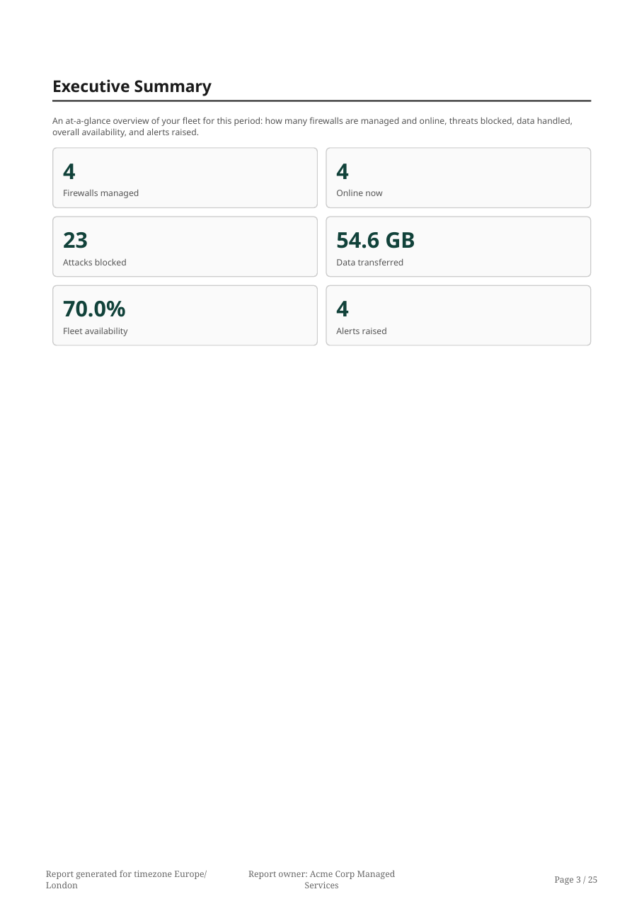
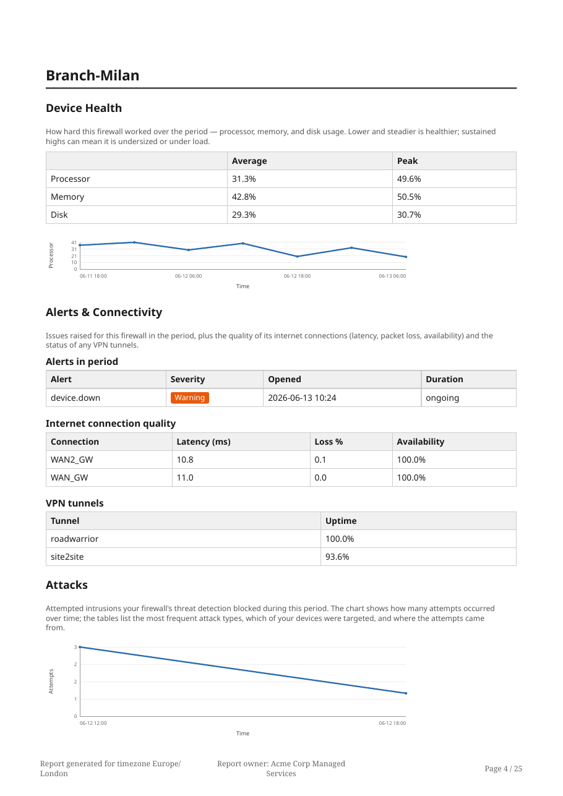
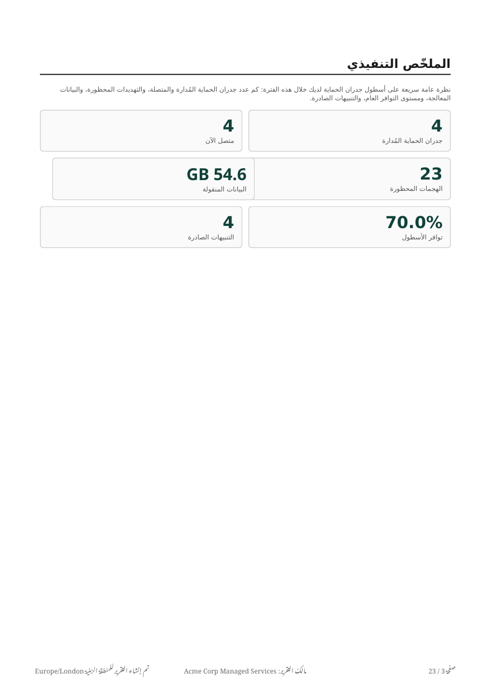

# Demo reports

Sample PDF reports generated by OPNGMS from **synthetic demo data** (fictional tenants — Acme, Globex,
Initech — no real customer data). They show what a scheduled or on-demand per-tenant report looks like,
including the enriched sections and the multi-language / right-to-left support.

| File | Tenant | Language |
|------|--------|----------|
| [`opngms-demo-report-acme-en.pdf`](opngms-demo-report-acme-en.pdf) | Acme | English |
| [`opngms-demo-report-globex-it.pdf`](opngms-demo-report-globex-it.pdf) | Globex | Italiano |
| [`opngms-demo-report-initech-de.pdf`](opngms-demo-report-initech-de.pdf) | Initech | Deutsch |
| [`opngms-demo-report-acme-ar.pdf`](opngms-demo-report-acme-ar.pdf) | Acme | العربية (RTL) |

All sections are enabled in these samples (they are individually toggleable per tenant and per device).

## Executive summary (client-facing KPIs)

## Per-device enrichment — health, alerts & connectivity, attacks

## Full localization, including right-to-left (Arabic)

---

These PDFs are regenerated from the demo seed; reports are produced server-side with WeasyPrint (remote
resource fetching disabled) and localized across all 12 supported languages.
